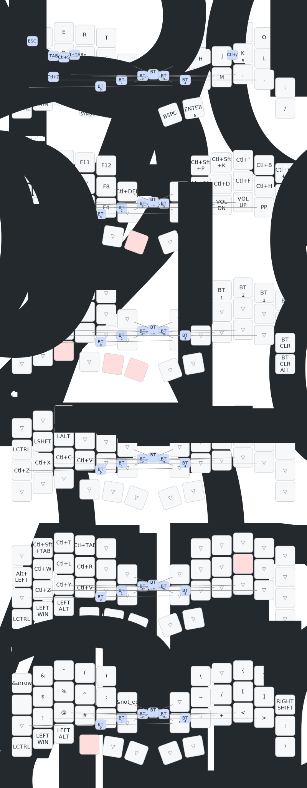

# zmk-config-roBa

## クイックリファレンス

### コンボ（デフォルトレイヤー）
| キー | 出力 |
|------|------|
| S + D | Tab |
| D + F | Shift+Tab |
| S + F | Ctrl+S（保存） |
| X + C | Ctrl+Z（アンドゥ） |
| J + K | Ctrl+/（コメント） |
| Q + W | Escape |

### SYMBOLレイヤー（LANGUAGE_1 ホールド）追加記号
| キー | 出力 |
|------|------|
| Q | `->` |
| A | `=>` |
| extra（行2の追加キー） | `!=` |

### FUNCTIONレイヤー右手（LANGUAGE_1 ホールド）
| キー | 操作 |
|------|------|
| Y | Ctrl+Shift+P（コマンドパレット） |
| U | Ctrl+Shift+K（行削除） |
| I | Ctrl+`（ターミナル） |
| O | Ctrl+B（サイドバー） |
| P | Ctrl+Shift+E（エクスプローラー） |
| H | Alt+Shift+F（フォーマット） |
| J | Ctrl+D（次の同一選択） |
| K | Ctrl+F（検索） |
| L | Ctrl+H（置換） |
| エンコーダー | 音量 |

### SCROLLレイヤー左手（K ホールド）
| キー | 操作 |
|------|------|
| W / E / R | 前タブ / 新タブ / 次タブ |
| A | Alt+Left（ブラウザ戻る） |
| S | Ctrl+W（タブ閉じる） |
| D | Ctrl+L（アドレスバー） |
| F | Ctrl+R（リロード） |
| エンコーダー | 水平スクロール |

### MOUSEレイヤー左手（トラックボール動作時）
| キー | 操作 |
|------|------|
| A / S / D | Ctrl / Shift / Alt（修飾キー） |
| Z / X / C / V | Undo / Cut / Copy / Paste |
| エンコーダー | ズームイン/アウト |